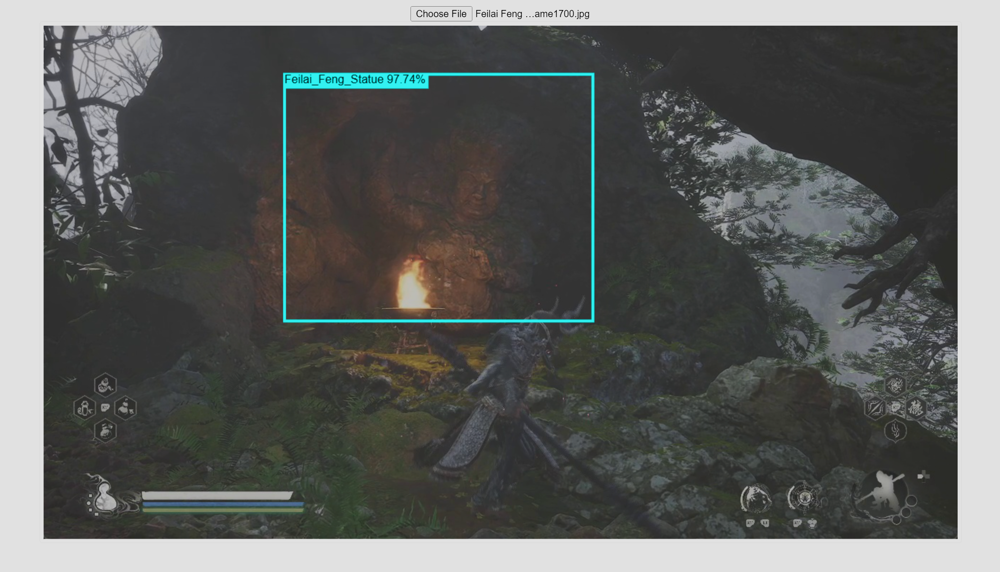

## Acknowledgment

This project is inspired by the TensorFlow.js object detection tutorial by Hugo Zanini, which provides an excellent introduction to creating custom object detection models and deploying them in real-time in a web browser. I sincerely appreciate the effort and detailed walkthrough presented in his repository, which served as a valuable guide for my project.

link: https://github.com/hugozanini/TFJS-object-detection/tree/master


## How to use / access

To start the detection process, visit the following url:
```
https://cultural-element-detect.glitch.me/
```


Once there, you’ll see the webpage hosted by Glitch. Click the **Choose File** button to upload an image.
This project currently supports only one class for detection. To test it, you can download images from the **images** folder in this repository.

After uploading the image, you should see results similar to the screenshot below.


